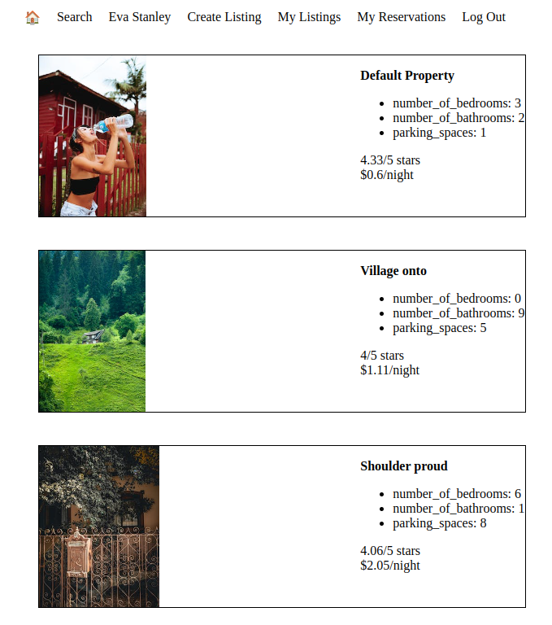
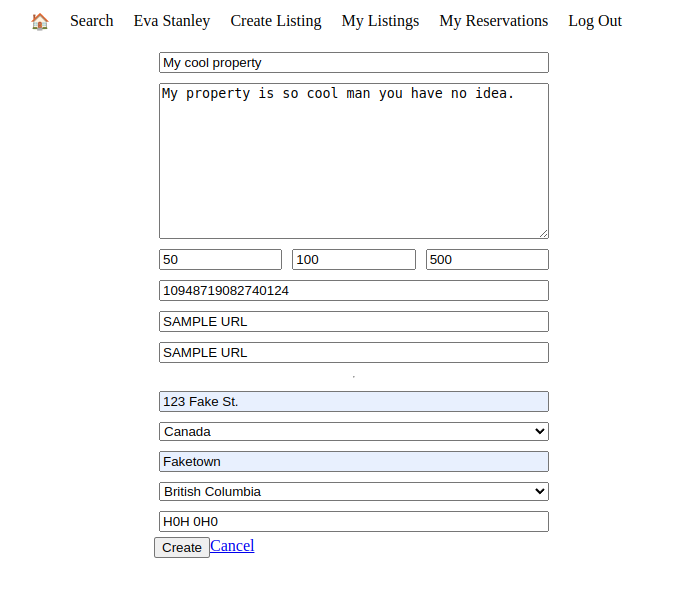
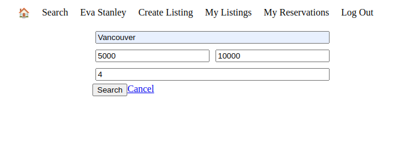

# LightBnB

This is a project that allows users to interact with a database of properties.

A user can:
- Create and login to an account
- Submit a property to their database
- Check their LightBnB reservations
- Search through the database of LightBnB properties with multiple search parameters

## Setup Guide

1. Clone the repo using Git
2. `cd /LightBnB_WebApp-master`
3. Use `npm i` to install all dependencies
4. Use `npm run local` to start the server
5. Connect to the app by going to `localhost:3000`

## Screenshots
- Property Listing (Homepage)

- Add property

- Search properties
